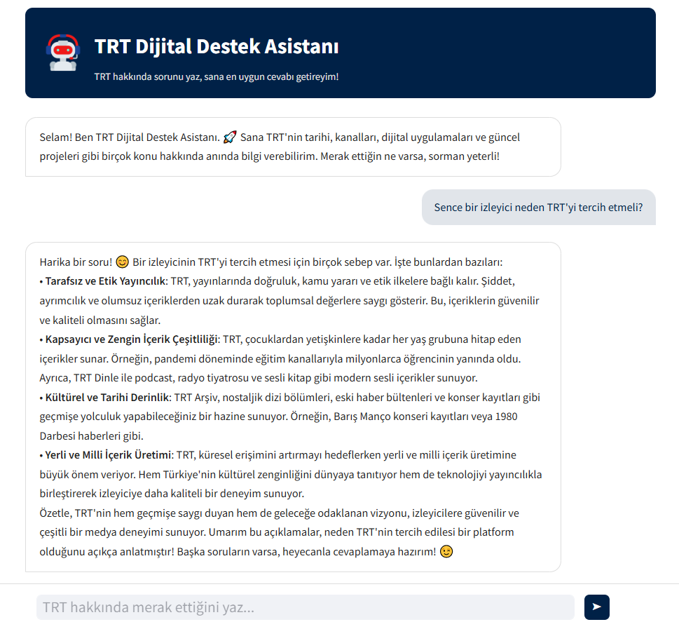
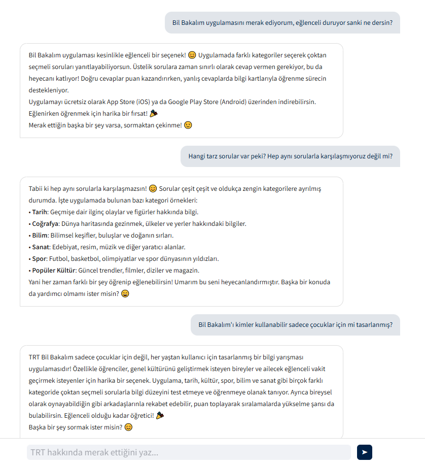

# 🎯 TRT Digital Support Assistant | RAG-Based Smart Q&A System

This project is an **AI-powered smart support assistant** built on a **Retrieval-Augmented Generation (RAG)** architecture, developed specifically for **TRT's corporate knowledge base**.  
The system **semantically analyzes** user questions in natural language and retrieves the most relevant internal content to generate **meaningful, context-aware answers** with the help of an **LLM (Large Language Model)**.

By combining **semantic search**, **vector-based retrieval**, and **LLM-powered text generation**, this assistant ensures **high accuracy**, **corporate consistency**, and a **seamless user experience**.

---

## 🖼️ System Overview

User Question → Embedding → Semantic Search (FAISS) → Context → LLM → Answer → UI

---

## 🛠️ Key Technologies

- **Backend**: FastAPI  
- **Vector Database**: FAISS  
- **Embedding Model**: SentenceTransformers  
- **Large Language Model (LLM)**: Azure OpenAI  
- **Web Interface**: Streamlit  
- **Containerization**: Docker  
- **Data Collection**: Web Scraping (Selenium, BeautifulSoup)  
- **Logging**: Python logging library, local file-based storage

---

## ⚙️ System Architecture & Flow

1. **Question Embedding**  
   The user's question is transformed into a dense vector representation using SentenceTransformers, capturing semantic meaning rather than just keywords.

2. **Semantic Search**  
   The generated vector is compared against the corporate knowledge base stored in FAISS to find the most semantically similar entries.

3. **Context Creation**  
   Retrieved content is combined into a structured prompt, providing the LLM with the necessary background to craft a relevant and accurate response.

4. **Answer Generation**  
   The Azure OpenAI-powered LLM generates a human-like, contextually relevant answer, preserving the corporate tone.

5. **User Interface Presentation**  
   The answer is displayed in a Streamlit-powered chat interface, optimized for intuitive interactions.

6. **Interaction Logging**  
   All Q&A sessions are recorded via a logging system for future evaluation, fine-tuning, and analytics.

---

## ✨ Project Outcomes

- **Accurate Responses** — High precision due to targeted content retrieval  
- **Corporate Context** — Company-specific and consistent answers  
- **Scalable Infrastructure** — Modular architecture ready for expansion  
- **User-Friendly** — Chat-based design for real-world usability  
- **Continuous Improvement** — Logging enables system refinement over time  

---

## 📷 UI Preview & Example Usage

---

---

